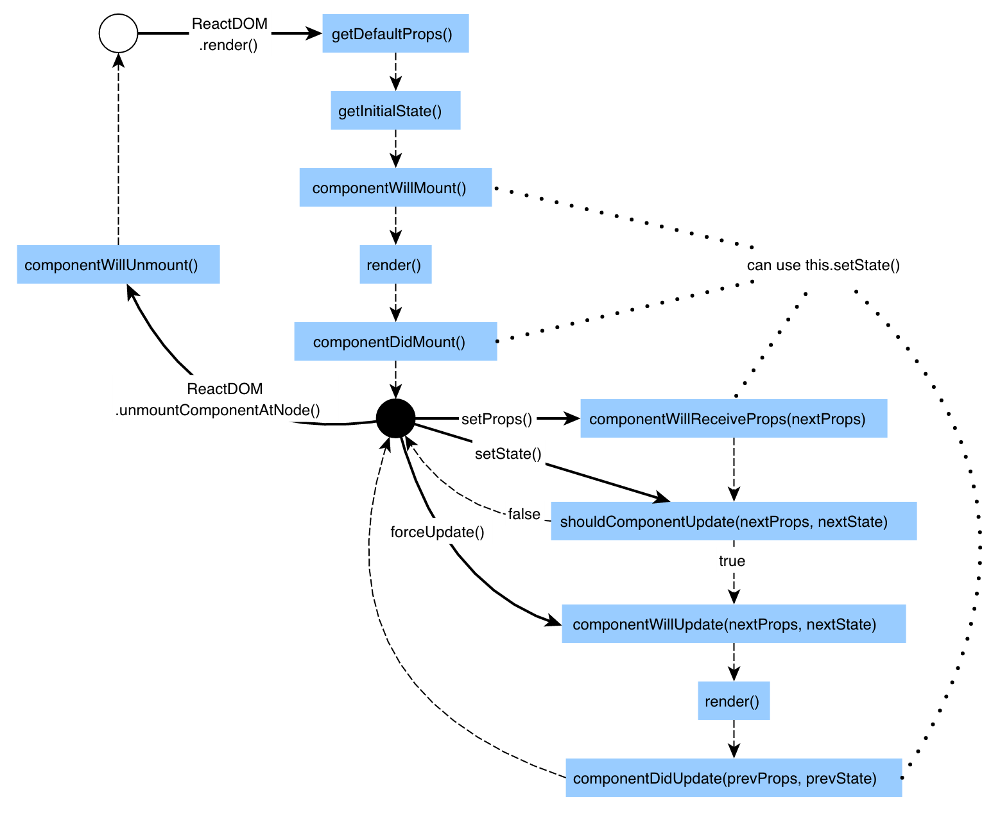

# Learning React 

### Component

Components let you split the UI into independent, reusable pieces, and think about each piece in isolation. 
    
     # React.Component is provided by React
     import React, { Component } from 'react'
     
* Life Cycle 
    
    
    
    


在React中，有提供兩個屬性進行資料的傳遞與儲存－`this.props` 以及 `this.state`。
這兩個屬性有不同的特性與行為，在使用上，大概可以區分為靜態資料使用`this.props`，動態資料使用`this.state`。
另外還有一個屬性`this.refs`，是用來取得UI元素的參考用的。

1. What is `this.props` ?
    
    this.props通常是使用在父元素傳值給子元素的情境上，直接看Example比較快。
    
    ```
    var App = React.createClass({
  		render: function() {
    		return <div>Hello~  {this.props.name}</div>;
  		}
	});
    
    React.render(<App name="foo"/>, document.getElementById('example'));
    
    # Output: Hello~ foo
    ```
    
    基本上，當父元素想傳值給子元素時，會設定在標籤的Attribute上。子元素就能夠透過`this.props.Attribute`以取得父元素傳進來的值。在這Example中，我們透過`name="foo"`傳給子元素
    
    若需要由子元素傳資料到父元素時，該怎麼辦呢？在React.JS的官方Sample中，有這麼一個處理方式。就是由父元素設定一個function到一個Attribute上，子元素再把要傳給父元素的資料放到function的arguments。這樣父元素的function就可以取得子元素傳進來的資料了。
    ```
    var App =  React.createClass({
      handleChildCallback: function(childValueObj){   
    console.log(childValueObj);
    this.setState({data:childValueObj.value});
      },
      getInitialState: function(){
        return {data:[]};
      },
      render: function() {
        return (
          <div>
            <h2>Hello {this.state.data}</h2>
            <AppChild ParentsFunction={this.handleChildCallback}/>
          </div>
        );
      }
    });

    var AppChild = React.createClass({
      onChangeHandler: function(){
        var childValue = React.findDOMNode(this.refs.text).value;    
        this.props.ParentsFunction({value:childValue});    
      },
      render: function(){ 
        return (      
            <input type="text" onChange={this.onChangeHandler} ref="text"/>      
         );      
      }
    });
    
    React.render(<App />, document.getElementById('example'));
    ```


    
    

